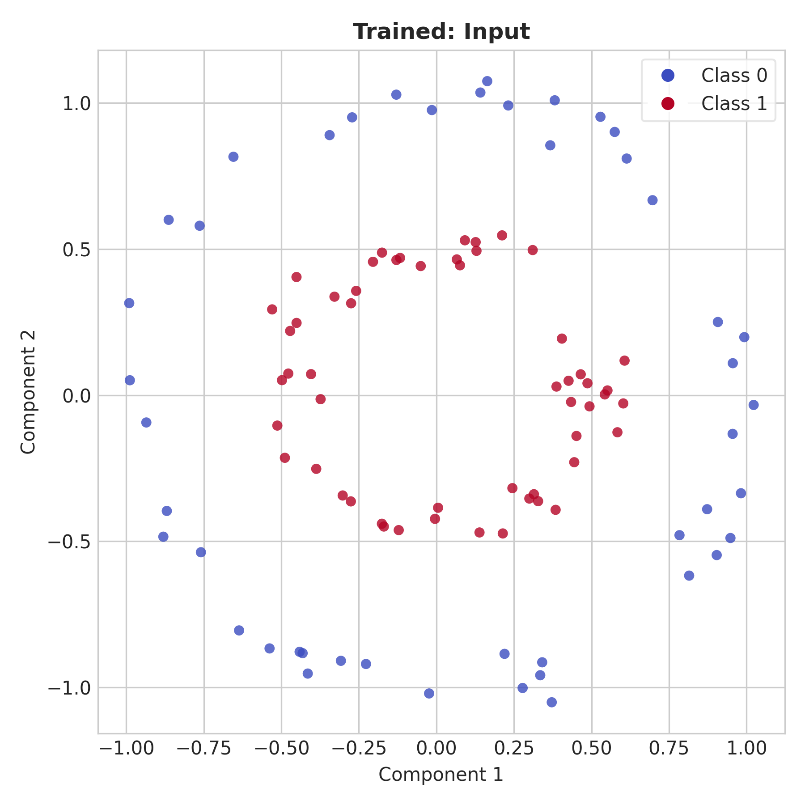
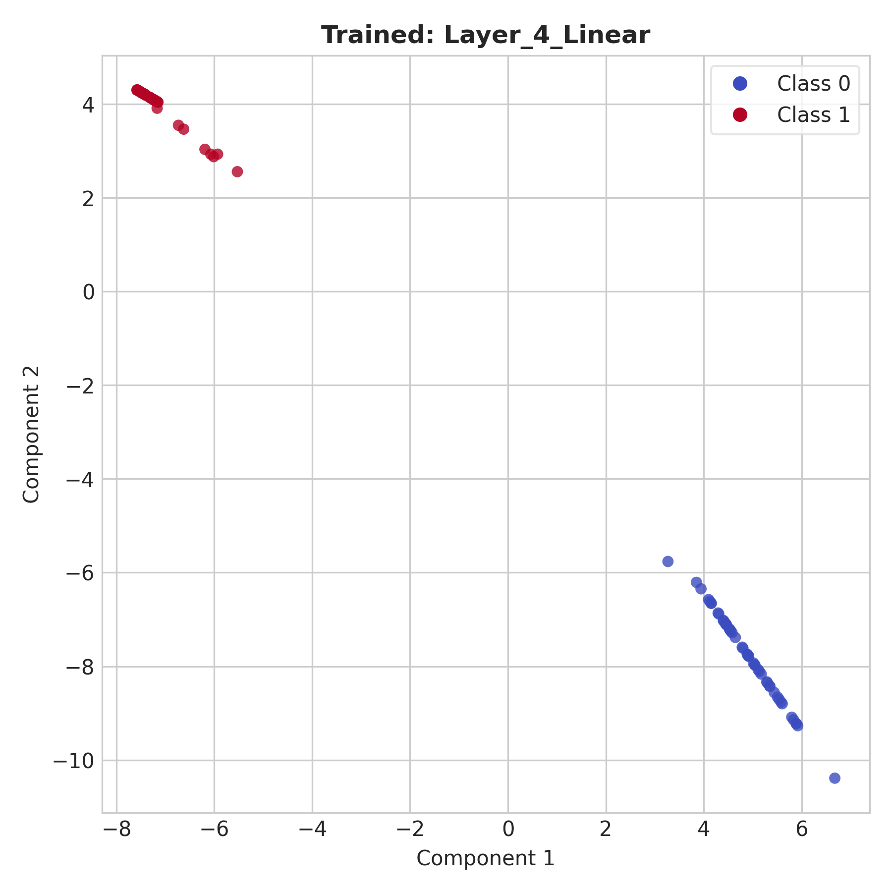
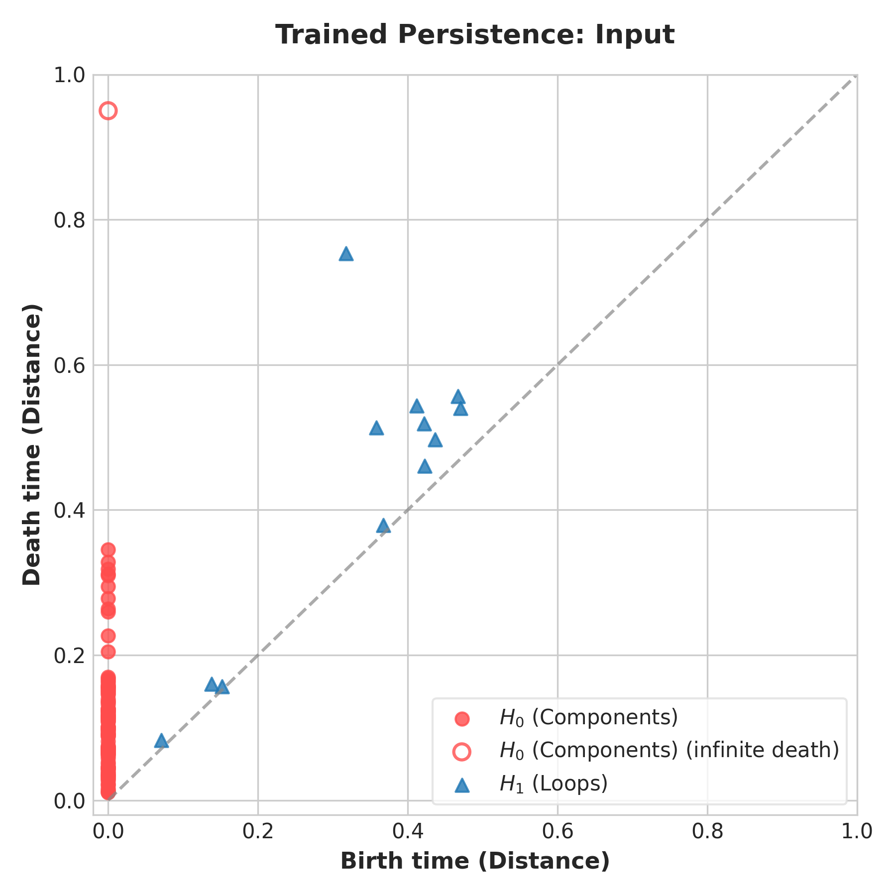
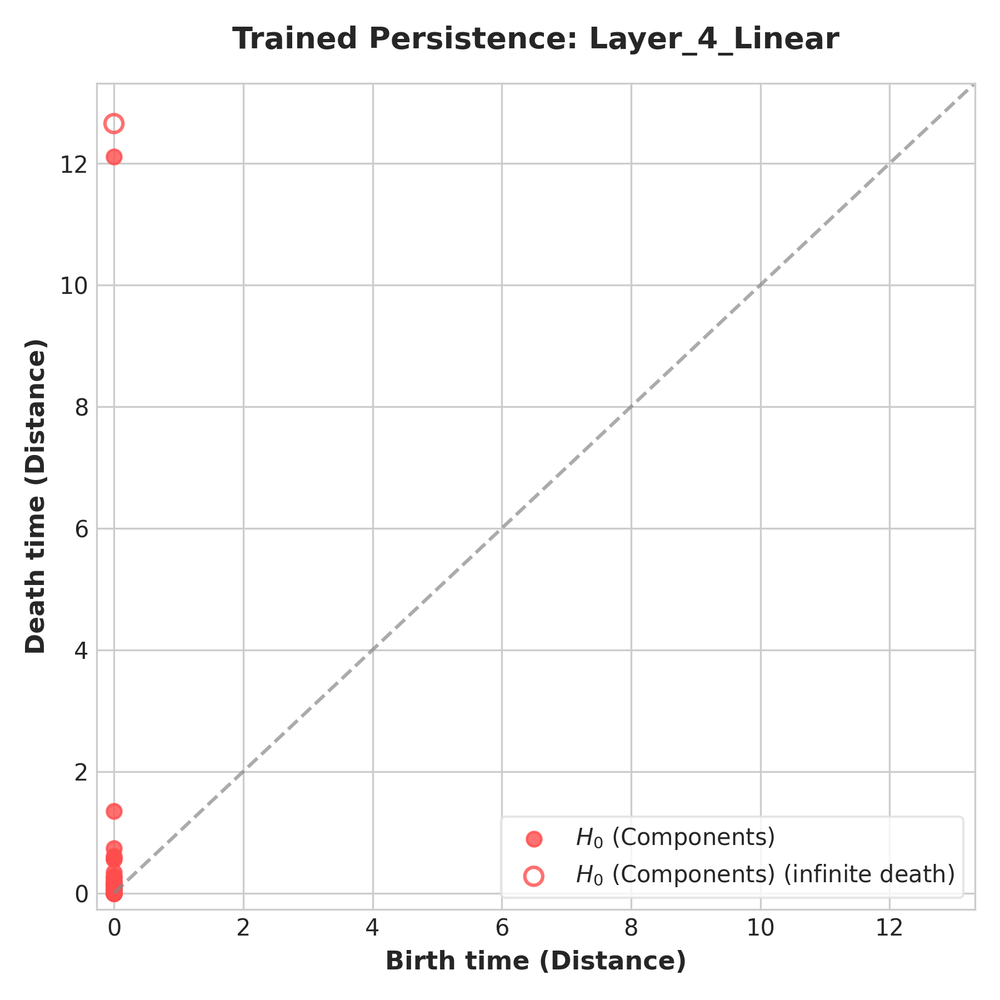
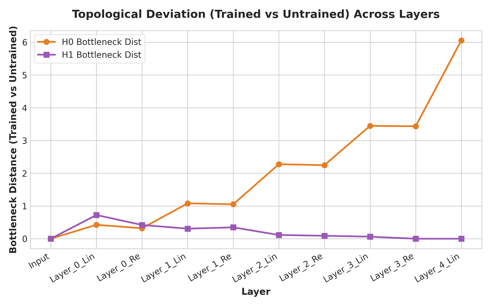

# Topological Analysis of Representation Learning in Neural Networks

This repository contains a modular research pipeline designed to investigate how the topological structure of data representations evolves as it propagates through deep neural network layers. Using **Point-Set Topology** principles, the project treats activation spaces as metric spaces, grows open $\epsilon$-ball neighborhoods around activation points, and measures the evolution of connectedness ($H_0$ components) and boundary loop structures ($H_1$ cycles) during model training.

---

## 🔬 Scientific Background

Standard neural network metrics like loss and accuracy quantify *performance*, but not the *geometry* of representation spaces. This project utilizes **Point-Set Topology** to:
* Model layer activations as a **Metric Space $(X, d)$** under the Euclidean distance metric.
* Grow open neighborhoods (balls of radius $\epsilon$, $B_d(x, \epsilon)$) and monitor how they overlap as $\epsilon$ increases.
* Track how the network (acting as a continuous function) transforms inputs to collapse loops ($H_1$ complexity) and separate connected components ($H_0$ complexity).
* Quantify representation topological deviation between **trained** and **untrained** states using **Bottleneck Distance**.

---

## 📊 Key Visualizations & Findings

Below are the empirical results obtained from training an MLP on a **Concentric Circles** dataset in 2D.

### 1. Representation Simplification (Trained vs. Untrained)
As data propagates through the network, the classes separate geometrically. In the output layer (`Layer_4_Linear`), the representation is compressed into distinct, easily separable connected components.

| Input Space | Final Layer Representation (`Layer_4_Linear`) |
| :---: | :---: |
|  |  |

### 2. Topological Collapse of Loops ($H_1$ Complexity)
The input dataset contains circular structures (non-trivial 1-dimensional homology). As training progresses, the network acts as a continuous mapping to contract/tear these loops to perform classification, causing $H_1$ persistence features to collapse.

| Input Persistence Diagram | Output Persistence Diagram |
| :---: | :---: |
|  |  |

### 3. Representation Shift
The Bottleneck Distance (topological deviation) between the trained and untrained representations increases deeper in the network, representing the structural shift driven by representation learning.



---

## 🛠️ Installation & Setup

1. **Clone the repository:**
   ```bash
   git clone https://github.com/krishamehta13/Topological-Data-Analysis-TDA-of-Representation-Learning-in-Neural-Networks.git
   cd Topological-Data-Analysis-TDA-of-Representation-Learning-in-Neural-Networks
   ```

2. **Install requirements:**
   Ensure you have PyTorch, Matplotlib, Scikit-Learn, and the topological libraries installed:
   ```bash
   pip install torch numpy scipy matplotlib scikit-learn ripser gudhi
   ```

---

## 🚀 Running Experiments

You can run experiments using the orchestrator script `main.py` with custom datasets (`circles`, `torus`, `spirals`):

```bash
# Run on Concentric Circles (2D)
python main.py --dataset circles --epochs 40 --ph_samples 100 --out_dir ./results_circles

# Run on Torus (3D)
python main.py --dataset torus --epochs 40 --ph_samples 100 --out_dir ./results_torus
```

### Script Arguments:
* `--dataset`: Dataset topology (`circles`, `torus`, `spirals`).
* `--epochs`: Number of network training epochs (default: `50`).
* `--ph_samples`: Number of data points to subsample for persistent homology calculation (keeps calculation efficient).
* `--out_dir`: Directory to save generated reports and plots.
